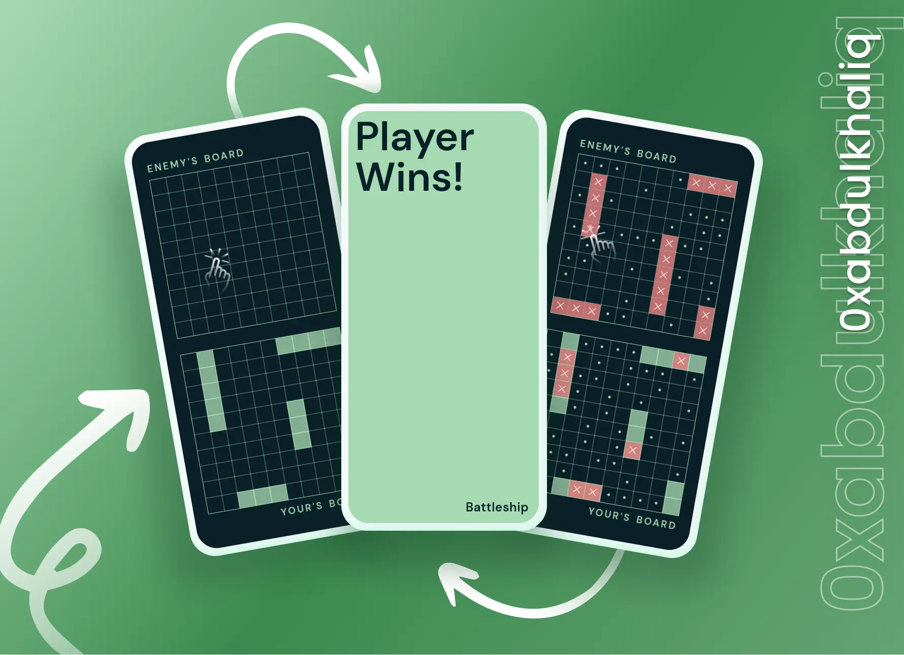

<br>
<div align="center">
<picture>
    <source media="(prefers-color-scheme: light)" srcset="https://readme-typing-svg.herokuapp.com?font=Space+Grotesk&weight=600&size=40&pause=&color=000&center=true&vCenter=true&repeat=false&random=false&width=280&height=60&lines=Battleship">
    
  </picture>
<br>

**❝** Command your fleet and conquer the seas in our Battleship showdown! **❞**

<br>
  <p>
    ❯ &nbsp;
    <a href="https://battleship-0xabdulkhalid.vercel.app/">View Demo</a>
    &nbsp;·&nbsp;
    <a href="https://github.com/0xabdulkhalid/battleship/issues">Report Bug</a>
    &nbsp;·&nbsp;
    <a href="https://github.com/0xabdulkhalid/battleship/issues">Request Feature</a>
     &nbsp; ❮
  </p>
</div>

<br>

<div align='center'>

</div>

<br>

## Project Overview
- Battleship project was crafted with the main goal of exploring **Test-Driven Development (TDD)** using **Jest**. 
- Built during partial completion of Odin Project's Full-Stack JavaScript Path.
- Each essential modules like Player, Gameboard, and Ship were meticulously tested before diving into the user interface (UI) development. 
- This approach ensures a robust foundation, allowing for a smooth and reliable gaming experience.
- I have additional features to incorporate; however, due to time constraints, I will address them in the future.

<br>

## Learn to Play Battleship
- If you're already familiar with the rules of Battleship, you can skip this section. 
- However, if you're new to the game or need a quick refresher, you can read the [Game's Manual](https://en.wikipedia.org/wiki/Battleship_(game)) on Wikipedia.
- For a visual guide, check out this [video tutorial](https://youtu.be/RY4nAyRgkLo) on Youtube.

<br>

## Installation

> [!NOTE]  
> If you prefer not to install it locally, you can also access the [live demo](https://battleship-0xabdulkhalid.vercel.app/) version

To set up the Battleship Application locally, follow these steps:

1. Clone the GitHub repository to your local machine:

   ```bash
   git clone https://github.com/0xabdulkhalid/battleship.git
   ```

2. Navigate to the project's directory:

   ```bash
   cd battleship
   ```

3. Install the project's dependencies using npm:

   ```bash
   npm install
   ```

4. Build the project to bundle JavaScript, minify HTML and CSS, and move images:

   ```bash
   npm run build
   ```

5. The build files can be found on `dist` (distribution) directory.

<br>

## Pagespeed Insights Score
  
- ||
  | :-----: |
  |  <b>Overall Score 99.4%, Average of Mobile and Desktop</b><br>[ Mobile devices score is only shown below ] |
  | |
  |  |
  | |
  | Check out [**Pagespeed Insights**](https://pagespeed.web.dev/analysis/https-battleship-0xabdulkhalid-vercel-app/88ptn9rxjc?form_factor=mobile) to get live score |
  ||

<br>

## Built With

<div align=center>

 &nbsp;&nbsp; &nbsp;&nbsp; &nbsp;&nbsp; &nbsp;&nbsp; &nbsp;&nbsp;

</div>

<br>

## Tools Used

<div align=center>
  
 &nbsp;&nbsp; &nbsp;&nbsp; &nbsp;&nbsp; &nbsp;&nbsp;

&nbsp;&nbsp; &nbsp;&nbsp; &nbsp;&nbsp; &nbsp;&nbsp;

</div>

<br>

## Let's Connect 👋

<div align=center>

  <a href="https://linkedin.com/in/0xabdulkhalid" >
    
  </a>&nbsp;&nbsp;

  <a href="mailto:0xabdulkhalid@gmail.com" target="_blank">
    
  </a>&nbsp;&nbsp;

  <a href="https://www.github.com/0xabdulkhalid/" >
    
  </a>

</div>

<br>
